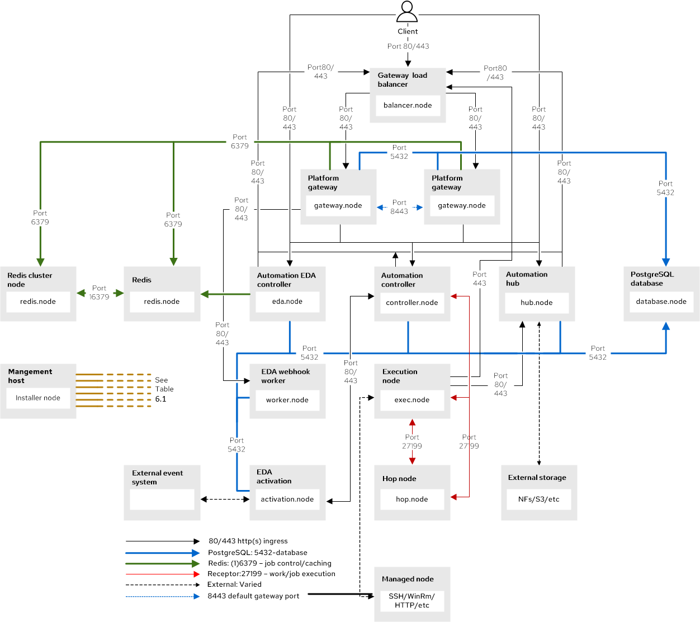
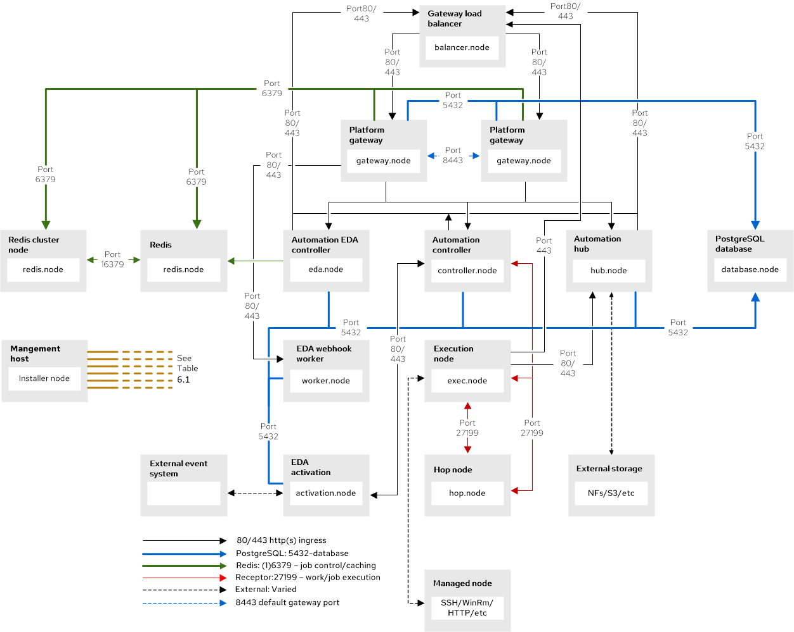

:_mod-docs-content-type: REFERENCE

[id="ref-network-ports-protocols_{context}"]

= Network ports and protocols

[role="_abstract"]
{PlatformName} uses several ports to communicate with its services. These ports must be open and available for incoming connections to the {PlatformName} server in order for it to work. Ensure that these ports are available and are not blocked by a firewall.

The following architectural diagram is an example of a fully deployed {PlatformNameShort} with all possible components.

[NOTE]
====
In some of the following use cases, hop nodes are used instead of a direct link from an execution node. 
Hop nodes are an option for connecting control and execution nodes. 
Hop nodes use minimal CPU and memory, so vertically scaling hop nodes does not impact system capacity.
====

[NOTE]
====
The following diagram shows client initiated connections between {PlatformNameShort} components.
Direct connections shown in the diagram between the Client and {HubName}, {EDAName}, and {ControllerName} only apply when systems are upgraded from {PlatformName} 2.4 to {PlatformName} {PlatformVers}.
This provides backward compatibility.
====

**{PlatformNameShort} Client initiated network ports and protocols**

[NOTE]
====
The following diagram shows internally initiated connections between {PlatformNameShort} components for new installs {PlatformName} {PlatformVers}.
====

**{PlatformNameShort} Internally initiated network ports and protocols**

The following table indicates the destination port and the direction of network traffic:

[NOTE]
====
The following default destination ports and installer inventory listed are configurable. 
If you choose to configure them to suit your environment, you might experience a change in behavior.
====

**Network ports and protocols**
[cols="12%,12%,17%,17%,20%,27%,27%",options="header",]
|===
| Node | Port | Source | Protocol | Service | Required for | Installer Inventory Variable 
| {HubNameStart} | 22 | Installer node | TCP | SSH | Management (Install, Configure, Upgrade) | `ansible_port`
| {HubNameStart} | 80/443 | Installer node | TCP | HTTP/HTTPS | Enables installer node to push the execution environment image to automation hub when using the bundle installer. | `ansible_port`
| {HubNameStart}  | 80/443 | {ControllerNameStart} | TCP | HTTP/HTTPS | Pull collections |
| {HubNameStart} | 80/443 | {EDAName} node | TCP | HTTP/HTTPS | Pull container decision environments |
| {HubNameStart} | 80/443 | Execution node | TCP | HTTP/HTTPS | Allows execution nodes to pull the execution environment image from {HubName} |
| {HubNameStart} | 80/443| Gateway load balancer/Ingress node | TCP | HTTP/HTTPS | Accessing the component directly from {Gateway} | `automationgateway_main_url`
| {HubNameStart} | 443 | {GatewayStart} | TCP | HTTPS | Link between {Gateway} and {PlatformNameShort} components |
| {HubNameStart} | 6379 | {EDAName} | TCP | Redis | Event processing | 
| {ControllerNameStart} | 22 | Installer node | TCP | SSH | Management (Install, Configure, Upgrade) | `ansible_port`
| {ControllerNameStart} | 80/443 | {EDAName} | TCP | HTTP/HTTPS | Launch {ControllerName} jobs | 
| {ControllerNameStart} | 80/443 | {GatewayStart} | TCP | HTTP/HTTPS | Link between {Gateway} and {PlatformNameShort} components |
| {ControllerNameStart} | 80/443 | Gateway load balancer/Ingress node | TCP | HTTP/HTTPS | Accessing the component directly from Platform gateway | 
| {ControllerNameStart} | 27199 | Execution node | TCP | Receptor | Used for Mesh peering and communication. See <<con-receptor-mesh-overview_{context},Overview of Receptor and Mesh communication>>. | `receptor_listener_port` / `peers`
| {EDAName} | 22 | Installer node | TCP | SSH | Management (Install, Configure, Upgrade) | `ansible_port`
| {EDAName} | 80/443 | {GatewayStart} | TCP | HTTP/HTTPS | Link between {Gateway} and {PlatformNameShort} components | 
| {EDAName} | 80/443 | Gateway load balancer/Ingress node | TCP | HTTP/HTTPS | Accessing the component directly from {Gateway} | `automationgateway_main_url
| {EDAName} | 8443 | {GatewayStart} | TCP | HTTPS | Receiving event stream traffic |  
| Execution node | 22 | Installer node | TCP | SSH | Management (Install, Configure, Upgrade) | `ansible_port`
| Execution node | 443 | Gateway load balancer/Ingress node | TCP | HTTPS | | `automationgateway_main_url` 
| Execution node | 27199 | {ControllerNameStart} | TCP | Receptor | Used for Mesh peering and communication. See <<con-receptor-mesh-overview_{context},Overview of Receptor and Mesh communication>>. | `receptor_listener_port` / `peers`
| Execution node | 27199 | {OCPShort} | TCP | Receptor | | 
| Hop node | 22 | Installer node | TCP | SSH | Management (Install, Configure, Upgrade) | `ansible_port`
| Hop node | 27199 | {ControllerNameStart} | TCP | Receptor | ENABLE connections from hop nodes to Receptor port if relayed through hop nodes. See <<con-receptor-mesh-overview_{context},Overview of Receptor and Mesh communication>>. | `receptor_listener_port`
| Hop node | 27199 | Execution node | TCP | Receptor | Used for Mesh peering and communication. See <<con-receptor-mesh-overview_{context},Overview of Receptor and Mesh communication>>. | `receptor_listener_port` / `peers`
| Hybrid node | 22 | Installer node | TCP | SSH | Management (Install, Configure, Upgrade) | `ansible_port`
| Hybrid node | 27199 | {ControllerNameStart} | TCP | Receptor | ENABLE connections from {ControllerName} to Receptor port if relayed through non-hop connected nodes. See <<con-receptor-mesh-overview_{context},Overview of Receptor and Mesh communication>>. | `receptor_listener_port` / `peers` 
| PostgreSQL database | 22 | Installer node | TCP | SSH | Management (Install, Configure, Upgrade) | `pg_port`
| PostgreSQL database | 5432 | {ControllerNameStart} | TCP | PostgreSQL | Required only if the internal database is used with another component. Otherwise, this port should not be open. | `automationcontroller_pg_port`
| PostgreSQL database | 5432 | {EDAName} | TCP | PostgreSQL | Required only if the internal database is used with another component. Otherwise, this port should not be open. | `automationedacontroller_pg_port`
| PostgreSQL | 5432 | {HubNameStart} | TCP | PostgreSQL | Required only if the internal database is used with another component. Otherwise, this port should not be open | `automationhub_pg_port`
| {OCPShort} | 6443 | {ControllerNameStart} | TCP | HTTP/HTTPS | Only required when using container groups to run jobs. | Hostname of OpenShift API server
| Redis node | 6379 | {ControllerNameStart} | TCP | Redis | Job launching |
| Redis node | 6379 | {EDAName} | TCP | Redis | Job launching | 
| Redis node | 6379 | {HubNameStart} | TCP | Redis | Job launching | 
| Redis node | 6379 | {GatewayStart} | TCP | Redis | Data storage and retrieval | 
| Redis node | 16379 | Redis node | TCP | Redis | Redis cluster bus port for a resilient Redis configuration |
| Mesh ingress | 443| Execution node | Receptor | HTTPS | If using mesh ingress, ensure that outbound HTTPS (port 443) is allowed from the execution nodes to the OpenShift route URL.|
| {GatewayStart} | 8443 | {GatewayStart} | TCP  | HTTPS | nginx | 
|===

[NOTE]
====
* Hybrid nodes act as a combination of control and execution nodes, and therefore Hybrid nodes share the connections of both. 
* If `receptor_listener_port` is defined, the machine also requires an available open port on which to establish inbound TCP connections, for example, 27199.
====

**{InsightsName}**
[options="header"]
|===
|URL |Required for
|link:https://api.access.redhat.com[https://api.access.redhat.com:443] |General account services, subscriptions
|link:https://cert-api.access.redhat.com[https://cert-api.access.redhat.com:443] |Insights data upload
|link:https://cert.console.redhat.com[https://cert.console.redhat.com:443] |Inventory upload and Cloud Connector connection
|link:https://{Console}[https://console.redhat.com:443] |Access to Insights dashboard
|===

**Automation Hub**
[options="header"]
|===
|URL |Required for
|link:https://console.redhat.com[https://console.redhat.com:443] |General account services, subscriptions
|link:https://catalog.redhat.com[https://catalog.redhat.com:443] |Indexing execution environments
|link:https://sso.redhat.com[https://sso.redhat.com:443] |TCP
|\https://automation-hub-prd.s3.amazonaws.com, \https://automation-hub-prd.s3.us-east-2.amazonaws.com| Firewall access
|link:https://galaxy.ansible.com[https://galaxy.ansible.com:443] |Ansible Community curated Ansible content
|\https://ansible-galaxy-ng.s3.dualstack.us-east-1.amazonaws.com | Dual Stack IPv6 endpoint for Community curated Ansible content repository
|link:https://registry.redhat.io[https://registry.redhat.io:443] |Access to container images provided by Red Hat and partners
|link:https://cert.console.redhat.com[https://cert.console.redhat.com:443] |Red Hat and partner curated Ansible Collections
|===

**Execution Environments (EE)**
[options="header"]
|===
|URL |Required for
|link:https://registry.redhat.io[https://registry.redhat.io:443] |Access to container images provided by Red Hat and partners
|`cdn.quay.io:443` | Access to container images provided by Red Hat and partners
|`cdn01.quay.io:443` | Access to container images provided by Red Hat and partners
|`cdn02.quay.io:443` | Access to container images provided by Red Hat and partners
|`cdn03.quay.io:443` | Access to container images provided by Red Hat and partners
|===

[IMPORTANT]
====
As of *April 1st, 2025*, `quay.io` is adding three additional endpoints. As a result, customers must adjust allow/block lists within their firewall systems lists to include the following endpoints:

* `cdn04.quay.io`
* `cdn05.quay.io`
* `cdn06.quay.io`

To avoid problems pulling container images, customers must allow outbound TCP connections (ports 80 and 443) to the following hostnames:

* `cdn.quay.io`
* `cdn01.quay.io`
* `cdn02.quay.io`
* `cdn03.quay.io`
* `cdn04.quay.io`
* `cdn05.quay.io`
* `cdn06.quay.io`

This change should be made to any firewall configuration that specifically enables outbound connections to `registry.redhat.io` or `registry.access.redhat.com`.

Use the hostnames instead of IP addresses when configuring firewall rules.

After making this change, you can continue to pull images from `registry.redhat.io` or `registry.access.redhat.com`. You do not require a `quay.io` login, or need to interact with the `quay.io` registry directly in any way to continue pulling Red Hat container images.

For more information, see link:https://access.redhat.com/articles/7084334[Firewall changes for container image pulls 2024/2025].
====