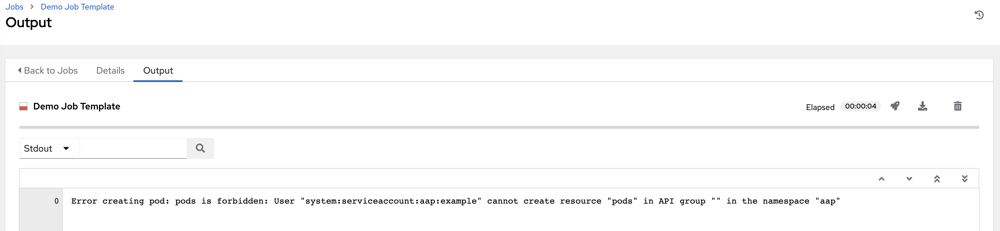

[[ag_ext_exe_env]]
== Container and Instance Groups

pair: container; groups pair: instance; groups

The controller allows you to execute jobs via ansible playbook runs
directly on a member of the cluster or in a namespace of an Openshift
cluster with the necessary service account provisioned called a
Container Group. You can execute jobs in a container group only
as-needed per playbook. For more information, see `ag_container_groups`
towards the end of this section.

For , see `ug_execution_environments` in the .

[[ag_instance_groups]]
=== Instance Groups

Instances can be grouped into one or more Instance Groups. Instance
groups can be assigned to one or more of the resources listed below.

* Organizations
* Inventories
* Job Templates

When a job associated with one of the resources executes, it will be
assigned to the instance group associated with the resource. During the
execution process, instance groups associated with Job Templates are
checked before those associated with Inventories. Similarly, instance
groups associated with Inventories are checked before those associated
with Organizations. Thus, Instance Group assignments for the three
resources form a hierarchy: Job Template *>* Inventory *>* Organization.

Here are some of the things to consider when working with instance
groups:

* You may optionally define other groups and group instances in those
groups. These groups should be prefixed with `instance_group_`.
Instances are required to be in the `automationcontroller` or
`execution_nodes` group alongside other `instance_group_` groups. In a
clustered setup, at least one instance *must* be present in the
`automationcontroller` group, which will appear as `controlplane` in the
API instance groups. See `ag_automationcontroller_group_policies` for
example scenarios.
* A `default` API instance group is automatically created with all nodes
capable of running jobs. Technically, it is like any other instance
group but if a specific instance group is not associated with a specific
resource, then job execution will always fall back to the `default`
instance group. The `default` instance group always exists (it cannot be
deleted nor renamed).
* Do not create a group named `instance_group_default`.
* Do not name any instance the same as a group name.

[[ag_automationcontroller_group_policies]]
==== `automationcontroller` group policies

pair: policies; automationcontroller groups

Use the following criteria when defining nodes:

* nodes in the `automationcontroller` group can define `node_type`
hostvar to be `hybrid` (default) or `control`
* nodes in the `execution_nodes` group can define `node_type` hostvar to
be `execution` (default) or `hop`

You can define custom groups in the inventory file by naming groups with
`instance_group_*` where `*` becomes the name of the group in the API.
Or, you can create custom instance groups in the API after the install
has finished.

The current behavior expects a member of an `instance_group_*` be part
of `automationcontroller` or `execution_nodes` group. Consider this
example scenario:

....
[automationcontroller]
126-addr.tatu.home ansible_host=192.168.111.126  node_type=control

[automationcontroller:vars]
peers=execution_nodes

[execution_nodes]

[instance_group_test]
110-addr.tatu.home ansible_host=192.168.111.110 receptor_listener_port=8928
....

As a result of running the installer, you will get the error below:

....
TASK [ansible.automation_platform_installer.check_config_static : Validate mesh topology] ***
fatal: [126-addr.tatu.home -> localhost]: FAILED! => {"msg": "The host '110-addr.tatu.home' is not present in either [automationcontroller] or [execution_nodes]"}
....

To fix this, you could move the box `110-addr.tatu.home` to an
`execution_node` group.

....
[automationcontroller]
126-addr.tatu.home ansible_host=192.168.111.126  node_type=control

[automationcontroller:vars]
peers=execution_nodes

[execution_nodes]
110-addr.tatu.home ansible_host=192.168.111.110 receptor_listener_port=8928

[instance_group_test]
110-addr.tatu.home 
....

This results in:

....
TASK [ansible.automation_platform_installer.check_config_static : Validate mesh topology] ***
ok: [126-addr.tatu.home -> localhost] => {"changed": false, "mesh": {"110-addr.tatu.home": {"node_type": "execution", "peers": [], "receptor_control_filename": "receptor.sock", "receptor_control_service_name": "control", "receptor_listener": true, "receptor_listener_port": 8928, "receptor_listener_protocol": "tcp", "receptor_log_level": "info"}, "126-addr.tatu.home": {"node_type": "control", "peers": ["110-addr.tatu.home"], "receptor_control_filename": "receptor.sock", "receptor_control_service_name": "control", "receptor_listener": false, "receptor_listener_port": 27199, "receptor_listener_protocol": "tcp", "receptor_log_level": "info"}}}
....

Upon upgrading from controller 4.0 or earlier, the legacy
`instance_group_` member will most likely have the awx code installed,
which would cause that node to be placed in the `automationcontroller`
group.

==== Configuring Instance Groups from the API

pair: instance group; configure pair: instance group; API

Instance groups can be created by POSTing to `/api/v2/instance_groups`
as a system administrator.

Once created, instances can be associated with an instance group with:

....
HTTP POST /api/v2/instance_groups/x/instances/ {'id': y}`
....

An instance that is added to an instance group will automatically
reconfigure itself to listen on the group's work queue. See the
following section, `ag_instance_group_policies`, for more details.

[[ag_instance_group_policies]]
==== Instance group policies

pair: policies; instance groups pair: clustering; instance group
policies

You can configure controller instances to automatically join Instance
Groups when they come online by defining a `policy`. These policies are
evaluated for every new instance that comes online.

Instance Group Policies are controlled by three optional fields on an
`Instance Group`:

* `policy_instance_percentage`: This is a number between 0 - 100. It
guarantees that this percentage of active controller instances will be
added to this Instance Group. As new instances come online, if the
number of Instances in this group relative to the total number of
instances is less than the given percentage, then new ones will be added
until the percentage condition is satisfied.
* `policy_instance_minimum`: This policy attempts to keep at least this
many instances in the Instance Group. If the number of available
instances is lower than this minimum, then all instances will be placed
in this Instance Group.
* `policy_instance_list`: This is a fixed list of instance names to
always include in this Instance Group.

The Instance Groups list view from the User Interface provides a summary
of the capacity levels for each instance group according to instance
group policies:

image:../../common/source/images/instance-groups_list_view.png[Instance
Group policy example]

==== Notable policy considerations

* `policy_instance_percentage` and `policy_instance_minimum` both set
minimum allocations. The rule that results in more instances assigned to
the group will take effect. For example, if you have a
`policy_instance_percentage` of 50% and a `policy_instance_minimum` of 2
and you start 6 instances, 3 of them would be assigned to the Instance
Group. If you reduce the number of total instances in the cluster to 2,
then both of them would be assigned to the Instance Group to satisfy
`policy_instance_minimum`. This way, you can set a lower bound on the
amount of available resources.
* Policies do not actively prevent instances from being associated with
multiple Instance Groups, but this can effectively be achieved by making
the percentages add up to 100. If you have 4 instance groups, assign
each a percentage value of 25 and the instances will be distributed
among them with no overlap.

==== Manually pinning instances to specific groups

pair: pinning; instance groups pair: clustering; pinning

If you have a special instance which needs to be exclusively assigned to
a specific Instance Group but don't want it to automatically join other
groups via "percentage" or "minimum" policies:

[arabic]
. Add the instance to one or more Instance Groups'
`policy_instance_list`
. Update the instance's `managed_by_policy` property to be `False`.

This will prevent the Instance from being automatically added to other
groups based on percentage and minimum policy; it will only belong to
the groups you've manually assigned it to:

....
HTTP PATCH /api/v2/instance_groups/N/
{
    "policy_instance_list": ["special-instance"]
}

HTTP PATCH /api/v2/instances/X/
{
    "managed_by_policy": False
}
....

==== Job Runtime Behavior

When you run a job associated with a instance group, some behaviors
worth noting are:

* If a cluster is divided into separate instance groups, then the
behavior is similar to the cluster as a whole. If two instances are
assigned to a group then either one is just as likely to receive a job
as any other in the same group.
* As controller instances are brought online, it effectively expands the
work capacity of the system. If those instances are also placed into
instance groups, then they also expand that group's capacity. If an
instance is performing work and it is a member of multiple groups, then
capacity will be reduced from all groups for which it is a member.
De-provisioning an instance will remove capacity from the cluster
wherever that instance was assigned. See the `ag_cluster_deprovision`
section for more detail.

Note

Not all instances are required to be provisioned with an equal capacity.

==== Control Where a Job Runs

If any of the job template, inventory, or organization has instance
groups associated with them, a job ran from that job template will not
be eligible for the default behavior. That means that if all of the
instances inside of the instance groups associated with these 3
resources are out of capacity, the job will remain in the pending state
until capacity becomes available.

The order of preference in determining which instance group to submit
the job to is as follows:

[arabic]
. job template
. inventory
. organization (by way of project)

If instance groups are associated with the job template, and all of
these are at capacity, then the job will be submitted to instance groups
specified on inventory, and then organization. Jobs should execute in
those groups in preferential order as resources are available.

The global `default` group can still be associated with a resource, just
like any of the custom instance groups defined in the playbook. This can
be used to specify a preferred instance group on the job template or
inventory, but still allow the job to be submitted to any instance if
those are out of capacity.

As an example, by associating `group_a` with a Job Template and also
associating the `default` group with its inventory, you allow the
`default` group to be used as a fallback in case `group_a` gets out of
capacity.

In addition, it is possible to not associate an instance group with one
resource but designate another resource as the fallback. For example,
not associating an instance group with a job template and have it fall
back to the inventory and/or the organization's instance group.

This presents two other great use cases:

[arabic]
. Associating instance groups with an inventory (omitting assigning the
job template to an instance group) will allow the user to ensure that
any playbook run against a specific inventory will run only on the group
associated with it. This can be super useful in the situation where only
those instances have a direct link to the managed nodes.
. An administrator can assign instance groups to organizations. This
effectively allows the administrator to segment out the entire
infrastructure and guarantee that each organization has capacity to run
jobs without interfering with any other organization's ability to run
jobs.

Likewise, an administrator could assign multiple groups to each
organization as desired, as in the following scenario:

_____________________________________________________________________________________________________________________________________________________________________________________
* There are three instance groups: A, B, and C. There are two
organizations: Org1 and Org2.
* The administrator assigns group A to Org1, group B to Org2 and then
assign group C to both Org1 and Org2 as an overflow for any extra
capacity that may be needed.
* The organization administrators are then free to assign inventory or
job templates to whichever group they want (or just let them inherit the
default order from the organization).

image:../../common/source/images/instance-groups-scenarios.png[Instance
Group example]
_____________________________________________________________________________________________________________________________________________________________________________________

Arranging resources in this way offers a lot of flexibility. Also, you
can create instance groups with only one instance, thus allowing you to
direct work towards a very specific Host in the controller cluster.

[[ag_instancegrp_deprovision]]
==== Deprovision Instance Groups

pair: groups; deprovisioning

Re-running the setup playbook does not automatically deprovision
instances since clusters do not currently distinguish between an
instance that was taken offline intentionally or due to failure.
Instead, shut down all services on the controller instance and then run
the deprovisioning tool from any other instance:

. Shut down the instance or stop the service with the command,
`automation-controller-service stop`.
. Run the deprovision command
`$ awx-manage deprovision_instance --hostname=<name used in inventory file>`
from another instance to remove it from the controller cluster registry.
+
___________________________________________________________
Example: `awx-manage deprovision_instance --hostname=hostB`
___________________________________________________________

Similarly, deprovisioning instance groups in the controller does not
automatically deprovision or remove instance groups, even though
re-provisioning will often cause these to be unused. They may still show
up in API endpoints and stats monitoring. These groups can be removed
with the following command:

_________________________________________________________
Example: `awx-manage unregister_queue --queuename=<name>`
_________________________________________________________

Removing an instance's membership from an instance group in the
inventory file and re-running the setup playbook does not ensure the
instance won't be added back to a group. To be sure that an instance
will not be added back to a group, remove via the API and also remove it
in your inventory file, or you can stop defining instance groups in the
inventory file altogether. You can also manage instance group topology
through the User Interface. For more information on managing instance
groups in the UI, refer to
`Instance Groups <userguide:ug_instance_groups>` in the .

Note

If you have isolated instance groups created in older versions of the
controller (3.8.x and earlier) and want to migrate them to execution
nodes to make them compatible for use with the automation mesh
architecture, see `migrate_iso_to_exe` in the .

[[ag_container_groups]]
=== Container Groups

single: container groups pair: containers; instance groups

supports `Container Groups`, which allow you to execute jobs in the
controller regardless of whether the controller is installed as a
standalone, in a virtual environment, or in a container. Container
groups act as a pool of resources within a virtual environment. You can
create instance groups to point to an OpenShift container, which are job
environments that are provisioned on-demand as a Pod that exists only
for the duration of the playbook run. This is known as the ephemeral
execution model and ensures a clean environment for every job run.

In some cases, it is desirable to have container groups be "always-on",
which is configured through the creation of an instance.

Note

Container Groups upgraded from versions prior to 4.0 will revert back to
default and completely remove the old pod definition, clearing out all
custom pod definitions in the migration.

Container groups are different from in that are container images and do
not use a virtual environment. See `ug_execution_environments` in the
for further detail.

==== Create a container group

To create a container group:

[arabic]
. Use the controller user interface to create an
`ug_credentials_ocp_k8s` credential that will be used with your
container group, see `ug_credentials_add` in the for detail.
. Create a new container group by navigating to the Instance Groups
configuration window by clicking *Instance Groups* from the left
navigation bar.
. Click the *Add* button and select *Create Container Group*.

image:../../common/source/images/instance-group-create-new-cg.png[IG -
create new CG]

[arabic, start=4]
. Enter a name for your new container group and select the credential
previously created to associate it to the container group.

[[ag_customize_pod_spec]]
==== Customize the Pod spec

provides a simple default Pod specification, however, you can provide a
custom YAML (or JSON) document that overrides the default Pod spec. This
field uses any custom fields (i.e. `ImagePullSecrets`) that can be
"serialized" as valid Pod JSON or YAML. A full list of options can be
found in the
https://docs.openshift.com/online/pro/architecture/core_concepts/pods_and_services.html[OpenShift
documentation].

To customize the Pod spec, specify the namespace in the *Pod Spec
Override* field by using the toggle to enable and expand the *Pod Spec
Override* field and click *Save* when done.

image:../../common/source/images/instance-group-customize-cg-pod.png[IG
- CG customize pod]

You may provide additional customizations, if needed. Click *Expand* to
view the entire customization window.

Note

The image used at job launch time is determined by which is associated
with the job. If a Container Registry credential is associated with the
, then the controller will attempt to make a `ImagePullSecret` to pull
the image. If you prefer not to give the service account permission to
manage secrets, you must pre-create the `ImagePullSecret` and specify it
on the pod spec, and omit any credential from the used.

Refer to the _Allowing Pods to Reference Images from Other Secured
Registries_ section of the
https://access.redhat.com/RegistryAuthentication[Red Hat Container
Registry Authentication article] for more information on how to create
image pull secrets.

Once the container group is successfully created, the *Details* tab of
the newly created container group remains, which allows you to review
and edit your container group information. This is the same menu that is
opened if the Edit
(image:../../common/source/images/edit-button.png[edit-button]) button
is clicked from the *Instance Group* link. You can also edit *Instances*
and review *Jobs* associated with this instance group.

image:../../common/source/images/instance-group-example-cg-successfully-created.png[IG
- example CG successfully created]

Container groups and instance groups are labeled accordingly.

Note

Despite the fact that customers have custom Pod specs, upgrades may be
difficult if the default `pod_spec` changes. Most any manifest can be
applied to any namespace, with the namespace specified separately, most
likely you will only need to override the namespace. Similarly, pinning
a default image for different releases of the platform to different
versions of the default job runner container is tricky. If the default
image is specified in the Pod spec, then upgrades do not pick up the new
default changes are made to the default Pod spec.

==== Verify container group functions

To verify the deployment and termination of your container:

[arabic]
. Create a mock inventory and associate the container group to it by
populating the name of the container group in the *Instance Group*
field. See `ug_inventories_add` in the for detail.

image:../../common/source/images/inventories-create-new-cg-test-inventory.png[Dummy
inventory]

[arabic, start=2]
. Create "localhost" host in inventory with variables:

....
{'ansible_host': '127.0.0.1', 'ansible_connection': 'local'}
....

image:../../common/source/images/inventories-create-new-cg-test-localhost.png[Inventory
with localhost]

[arabic, start=3]
. Launch an ad hoc job against the localhost using the _ping_ or _setup_
module. Even though the *Machine Credential* field is required, it does
not matter which one is selected for this simple test.

image:../../common/source/images/inventories-launch-adhoc-cg-test-localhost.png[Launch
inventory with localhost]

image:../../common/source/images/inventories-launch-adhoc-cg-test-localhost2.png[image]

You can see in the jobs detail view the container was reached
successfully using one of ad hoc jobs.

image:../../common/source/images/inventories-launch-adhoc-cg-test-localhost-success.png[Inventory
with localhost ping success]

If you have an OpenShift UI, you can see Pods appear and disappear as
they deploy and terminate. Alternatively, you can use the CLI to perform
a `get pod` operation on your namespace to watch these same events
occurring in real-time.

==== View container group jobs

When you run a job associated with a container group, you can see the
details of that job in the *Details* view and its associated container
group and the execution environment that spun up.

image:../../common/source/images/instance-group-job-details-with-cgs.png[IG
- instances jobs]

==== Kubernetes API failure conditions

When running a container group and the Kubernetes API responds that the
resource quota has been exceeded, the controller keeps the job in
pending state. Other failures result in the traceback of the *Error
Details* field showing the failure reason, similar to the example here:

[[ag_container_capacity]]
==== Container capacity limits

pair: container groups; capacity pair: container groups; limits

Capacity limits and quotas for containers are defined via objects in the
Kubernetes API:

* To set limits on all pods within a given namespace, use the
`LimitRange` object. Refer to the OpenShift documentation for
https://docs.openshift.com/online/pro/dev_guide/compute_resources.html#overview[Quotas
and Limit Ranges].
* To set limits directly on the pod definition launched by the
controller, see link:#customize-the-pod-spec[Customize the Pod spec] and
refer to the OpenShift documentation to set the options to
https://docs.openshift.com/online/pro/dev_guide/compute_resources.html#dev-compute-resources[compute
resources].

Note

Container groups do not use the capacity algorithm that normal nodes
use. You would need to explicitly set the number of forks at the job
template level, for instance. If forks are configured in the controller,
that setting will be passed along to the container.
