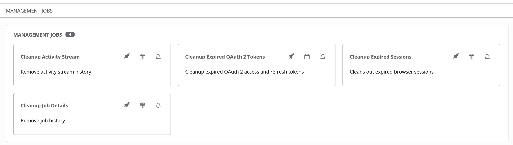
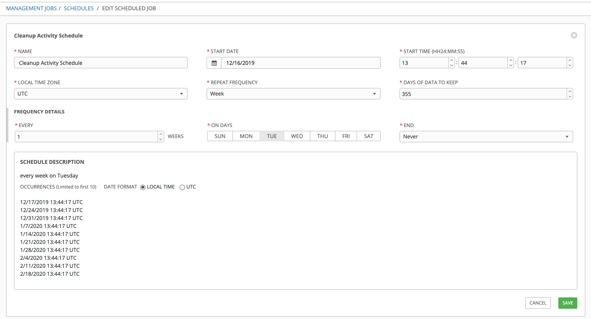
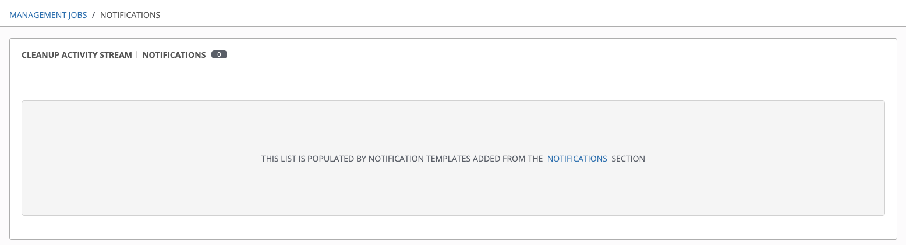
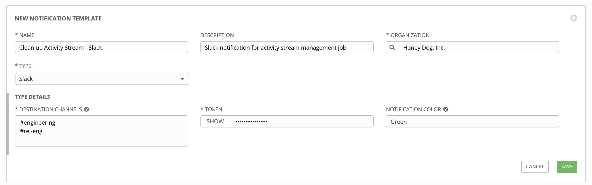

[[ag_management_jobs]]
== Management Jobs

single: management jobs single: cleaning old data single: removing old
data

*Management Jobs* assist in the cleaning of old data from the
controller, including system tracking information, tokens, job
histories, and activity streams. You can use this if you have specific
retention policies or need to decrease the storage used by your
controller database. Click *Management Jobs* from the left navigation
bar.

Several job types are available for you to schedule and launch:

* *Cleanup Activity Stream*: Remove activity stream history older than a
specified number of days
* *Cleanup Expired OAuth 2 Tokens*: Remove expired OAuth 2 access tokens
and refresh tokens
* *Cleanup Expired Sessions*: Remove expired browser sessions from the
database
* *Cleanup Job Details*: Remove job history older than a specified
number of days

=== Removing Old Activity Stream Data

pair: management jobs; cleanup activity stream single: activity stream
cleanup management job

To remove older activity stream data, click on the launch
() button
beside *Cleanup Activity Stream*.

image:images/ug-management-jobs-remove-activity-stream-launch.png[activity
stream launch - remove activity stream launch]

Enter the number of days of data you would like to save and click
*Launch*.

[[ag_mgmt_job_schedule]]
==== Scheduling

To review or set a schedule for purging data marked for deletion, click
on the image:../../userguide/source/images/schedule-button.png[schedule]
button.

image:images/ug-management-jobs-remove-activity-stream-schedule.png[activity
stream launch - remove activity stream schedule]

Note that you can turn this scheduled management job on and off easily
using the *ON/OFF* toggle button to the left of the Job Name.

Click on the Job Name, in this example "Cleanup Activity Schedule", to
review or edit the schedule settings. You can also use the *Add* button
to create a new schedule for this management job.

Enter the appropriate details into the following fields and click
*Save*:

* Name (required)
* Start Date (required)
* Start Time (required)
* Local Time Zone (the entered Start Time should be in this timezone)
* Repeat Frequency (the appropriate options display as the update
frequency is modified.)

The *Details* tab displays a description of the schedule and a list of
the scheduled occurrences in the selected Local Time Zone.

Note

Jobs are scheduled in UTC. Repeating jobs that runs at a specific time
of day may move relative to a local timezone when Daylight Saving Time
shifts occur.

[[ag_mgmt_job_notify]]
==== Notifications

To set or review notifications associated with this management job,
click the Notifications (  ) icon.

If none exist, click the *Notifications* link to create a new
notification. Notification types include:

* Email
* Grafana
* IRC
* Mattermost
* PagerDuty
* Rocket.Chat
* Slack
* Twilio
* Webhook

Refer to `ug_notifications` in the for more information.

=== Cleanup Expired OAuth2 Tokens

pair: management jobs; cleanup expired OAuth2 tokens single: expired
OAuth2 tokens cleanup management job

To remove expired OAuth2 tokens, click on the launch
() button
beside *Cleanup Expired OAuth2 Tokens*.

You can review or set a schedule for cleaning up expired OAuth2 tokens
by performing the same procedure described for activity stream
management jobs. See `ag_mgmt_job_schedule` for detail.

You can also set or review notifications associated with this management
job the same way as described in `ag_mgmt_job_notify` for activity
stream management jobs, and refer to `ug_notifications` in the for more
detail.

=== Cleanup Expired Sessions

pair: management jobs; cleanup expired sessions single: expired sessions
cleanup management job

To remove expired sessions, click on the launch
() button
beside *Cleanup Expired Sessions*.

You can review or set a schedule for cleaning up expired sessions by
performing the same procedure described for activity stream management
jobs. See `ag_mgmt_job_schedule` for detail.

You can also set or review notifications associated with this management
job the same way as described in `ag_mgmt_job_notify` for activity
stream management jobs, and refer to `ug_notifications` in the for more
detail.

=== Removing Old Job History

pair: management jobs; cleanup job history single: job history cleanup
management job

To remove job history older than a specified number of days, click on
the launch ()
button beside *Cleanup Job Details*.

image:images/ug-management-jobs-cleanup-job-launch.png[management jobs -
cleanup job launch]

Enter the number of days of data you would like to save and click
*Launch*.

Note

The initial job run for a controller resource (e.g. Projects, Job
Templates) is excluded from *Cleanup Job Details*, regardless of
retention value.

You can review or set a schedule for cleaning up old job history by
performing the same procedure described for activity stream management
jobs. See `ag_mgmt_job_schedule` for detail.

You can also set or review notifications associated with this management
job the same way as described in `ag_mgmt_job_notify` for activity
stream management jobs, and refer to `ug_notifications` in the for more
detail.
