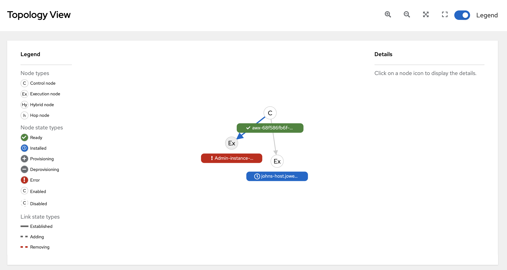
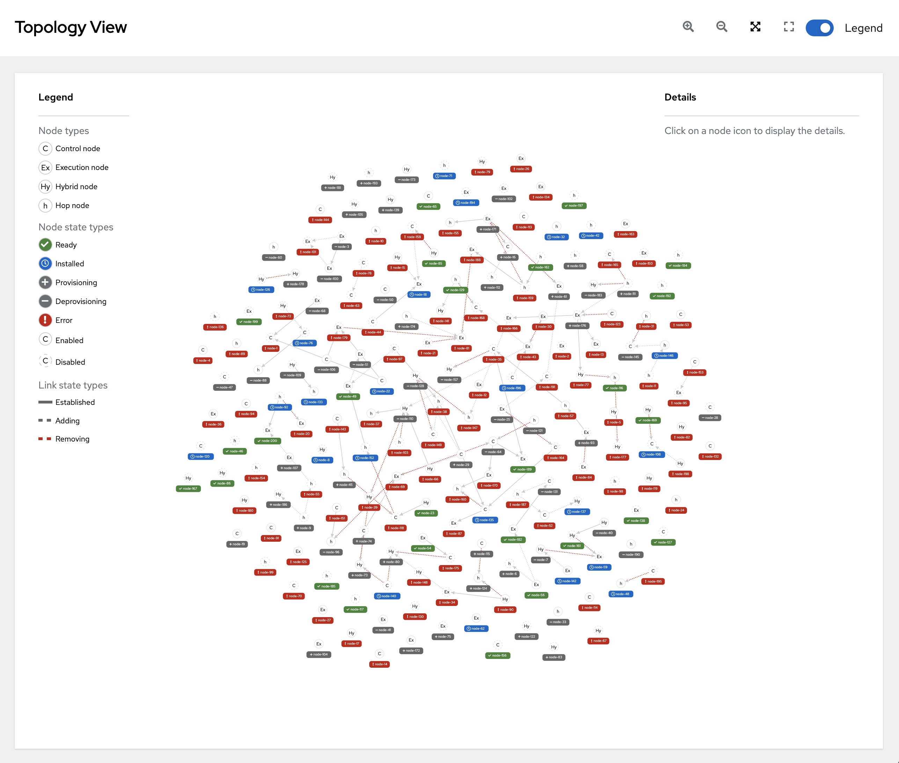
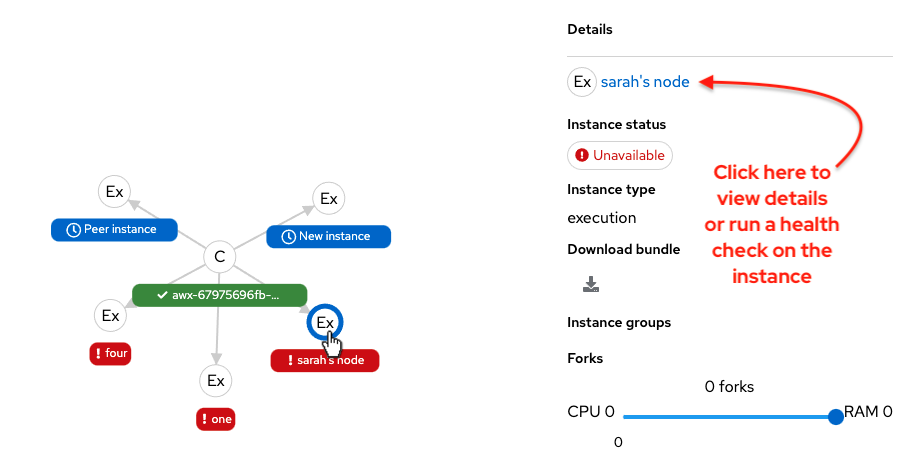
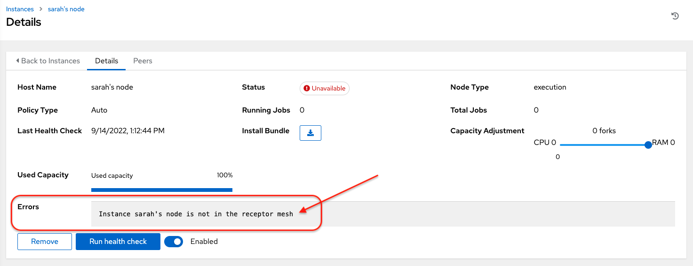

[[ag_topology_viewer]]
== Topology Viewer

pair: topology;viewer

Note

The topology viewer is in tech preview and is subject to change in a
future release.

The topology viewer allows you to view node type, node health, and
specific details about each node if you already have a mesh topology
deployed. To learn more about automation mesh, refer to the
https://access.redhat.com/documentation/en-us/red_hat_ansible_automation_platform/2.1/html/red_hat_ansible_automation_platform_automation_mesh_guide/assembly-planning-mesh[Red
Hat Ansible Automation Mesh Guide] on
https://access.redhat.com/documentation/en-us/red_hat_ansible_automation_platform[access.redhat.com].

To access the topology viewer from the controller user interface:

[arabic]
. In the Administration menu from left navigation bar, click *Topology
View*.

The Topology View opens and displays a graphic representation of how
each receptor node links together.

[arabic, start=2]
. To adjust the zoom levels, or manipulate the graphic views, use the
control buttons on the upper right-hand corner of the window.

You can also click and drag to pan around; and use the scroll wheel on
your mouse or trackpad to zoom. The fit-to-screen feature automatically
scales the graphic to fit on the screen and repositions it in the
center. It is particularly useful when you want to see a large mesh in
its entirety.

To reset the view to its default view, click *Reset zoom*.

[arabic, start=3]
. Refer to the Legend to the left of the graphic to identify the type of
nodes that are represented. See
https://access.redhat.com/documentation/en-us/red_hat_ansible_automation_platform/2.1/html/red_hat_ansible_automation_platform_automation_mesh_guide/assembly-planning-mesh#con-automation-mesh-node-types[Control
and execution planes] for more information on each type of node.

Note

If the Legend is not present, use the toggle on the upper right part of
the window to enable it.

Also in the Legend, you can see how the color corresponds to its status,
which is indicative of the health of the node. Node health is currently
being statically rendered at certain points in time dictated by the API,
and therefore, live polling of the node status is not available at this
time. The status updates provided by the API is also not configurable.

[arabic, start=4]
. Hover over a node and the connectors highlight to show its immediate
connected nodes or click on the node to retrieve details about it, such
as its hostname, node type, and status.

Click on the link for instance hostname from the details displayed, and
you will be redirected to its Details page to provide more information
about that node, most notably the reason for an `Error` status.

At the bottom of the Details view, you can run a health check on the
instance on an as-needed basis, or unassign jobs from the instance. By
default, jobs can be assigned to each node. However, you can disable it
to exclude the node from having any jobs running on it.
