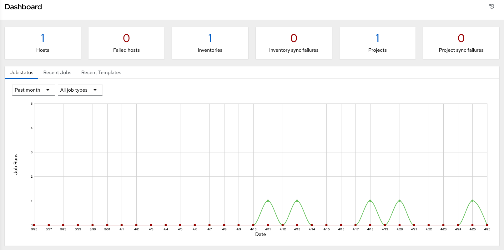

== Examine the Controller Dashboard

pair: dashboard; examine pair: settings menu; organization pair:
settings menu; users pair: settings menu; teams pair: settings menu;
credentials pair: settings menu; management jobs pair: settings menu;
inventory scripts pair: settings menu; notifications pair: settings
menu; credential types pair: settings menu; instance groups pair:
settings menu; help about

The Dashboard offers a friendly graphical framework for your IT
orchestration needs. Along the left side of the Dashboard is the
navigation menu, where you can quickly display different views, navigate
to your resources, grant access, and administer certain controller
features in the UI.

Click on the Menu image:../../common/source/images/menu-icon.png[menu]
icon at the top of the left navigation to hide or display the navigation
bar.

On the main Dashboard view, a summary appears listing your current *Job
Status*. You can filter the job status within a period of time or by job
type. Also available in their respective tabs are summaries of *Recent
Jobs* ran and *Recent Templates* used. These can be sorted by various
attributes.

The very last item in the navigation bar is *Settings*, which provides
access to the controller configuration Settings.

The Settings page allows administrators to configure authentication,
jobs, system-level attributes, customize the user interface, and product
license information. Refer to `ag_configure_tower` section for more
detail.

image:../../common/source/images/ug-settings-menu-screen.png[image]

Regardless of the window or action you're performing, the very top of
each page next to the your user icon is the About
(image:../../common/source/images/help-about-icon.png[about]) icon,
which provides you the versions of and Ansible you are currently
running.

Note

Keep in mind that the goal of this Quick Start is to launch a simple
playbook. To do this, a number of configuration options must be setup.
Completing the quick start configuration tasks now ensures that the
controller is configured properly and allows for easier executions of
more involved playbooks later on.
